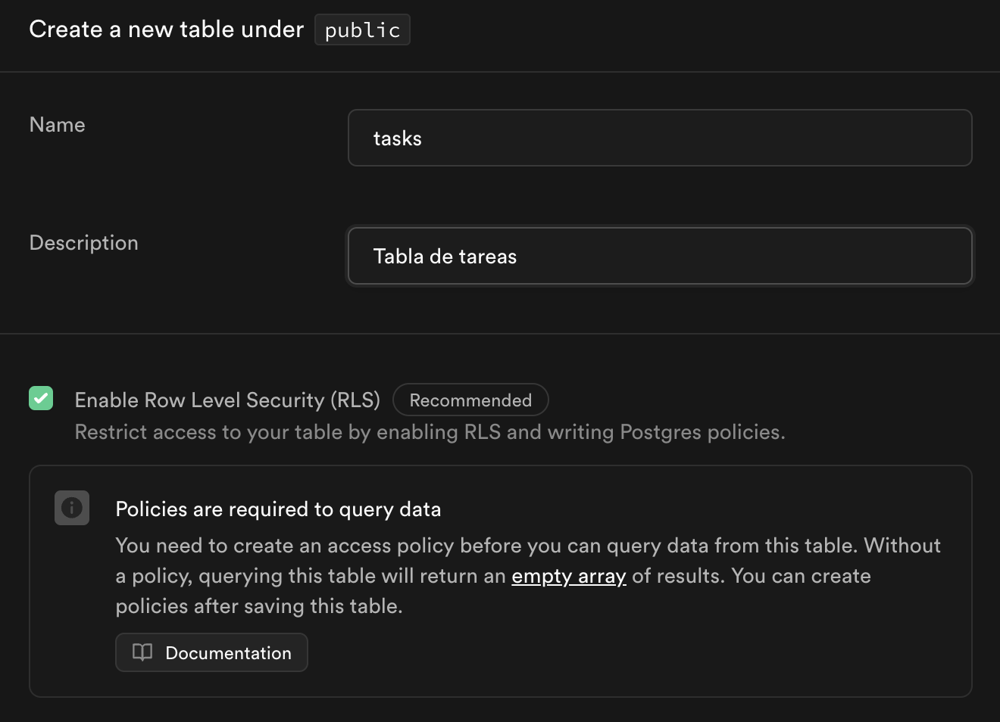
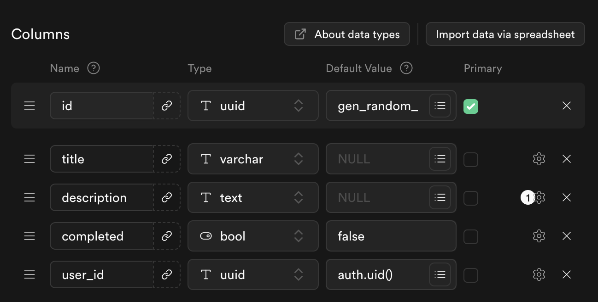
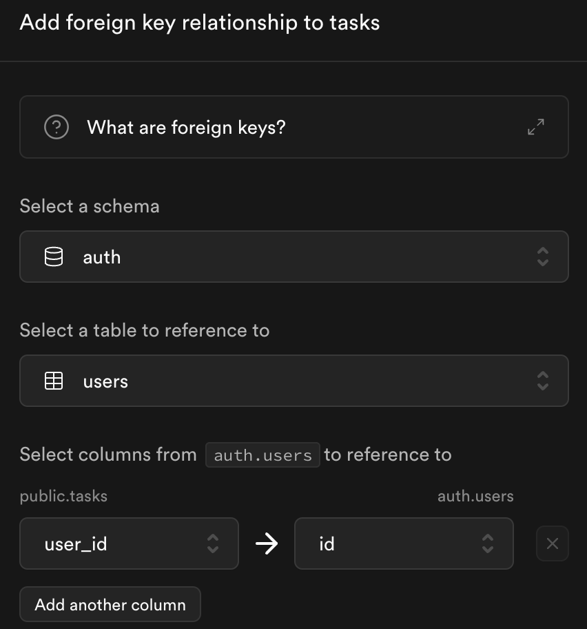
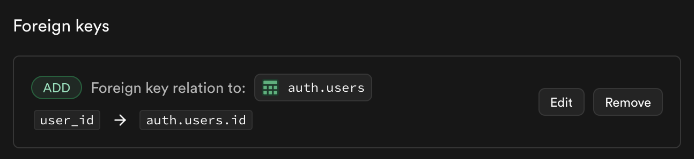
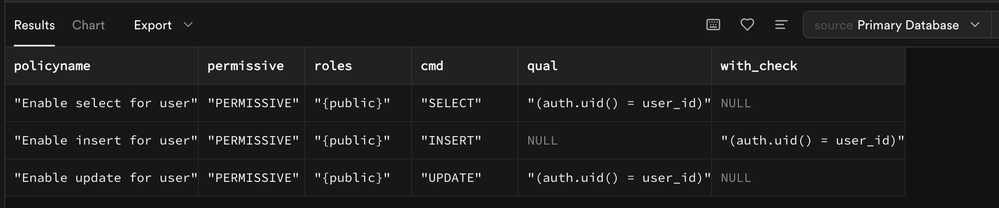

# Guía: CRUD Básico con Supabase y React Native Web

---

## Objetivo
Crear una funcionalidad básica para gestionar una lista de tareas con un backend en Supabase y un frontend en React Native Web.

---

## Pasos

### 1. Configuración del Backend (Supabase)

#### 1.1 Crear un proyecto en Supabase

1. Ve a [Supabase](https://supabase.com/) y crea una cuenta si aún no tienes una.

2. Crea un nuevo proyecto y anota la URL del proyecto y la clave de la API (found in Project Settings > API).

#### 1.2 Crear la tabla `tasks`

1. Ve a la sección **"Table Editor"** y crea una nueva tabla llamada `tasks`.



2. Define las columnas como sigue:

   - `id`: UUID (Primary Key, default value: `gen_random_uuid()`)
   - `title`: Varchar
   - `description`: Text (opcional)
   - `completed`: Boolean (default: `false`)
   - `user_id`: UUID (foreign key, referencia a la tabla `auth.users`), value: `auth.uid()`







#### 1.3 Activar Row-Level Security (RLS)

1. En la tabla `tasks`, habilita **Row-Level Security (RLS)**. También es posible habilitar esta opción desde SQL Editor:

```sql
  ALTER TABLE tasks ENABLE ROW LEVEL SECURITY;
```

2. Crea una política para que los usuarios solo puedan ver sus propias tareas:

```sql
  CREATE POLICY "Enable select for user" ON tasks
  FOR SELECT
  USING (auth.uid() = user_id);
```

Comprobación de los policies:

```sql
  SELECT policyname, permissive, roles, cmd, qual, with_check 
  FROM pg_policies 
  WHERE tablename = 'tasks';
```

El resultado debe ser similar a:



3. Crea otra política para permitir INSERT/UPDATE (inserción/actualización) solo a los propietarios:

```sql
  CREATE POLICY "Enable insert for user"
  ON tasks
  FOR INSERT
  WITH CHECK (auth.uid() = user_id);
```

```sql
  CREATE POLICY "Enable update for user"
  ON tasks
  FOR UPDATE
  USING (auth.uid() = user_id);
```
---

### 2. Configuración del Frontend (React Native Web)

#### 2.1 Crear el proyecto React Native Web

1. Inicializa un proyecto:

```bash
  npx create-expo-app tasks-app
  cd tasks-app
```

Para ejecutar el proyecto:

```bash
  npm run ios
  npm run android
  npm run web
```

2. Instala las dependencias necesarias:

```bash
   npm install @supabase/supabase-js react-native-web react-native-gesture-handler
```

---

Siguiente paso: [Conexión a Supabase](./02.conexion_a_supabase.md)