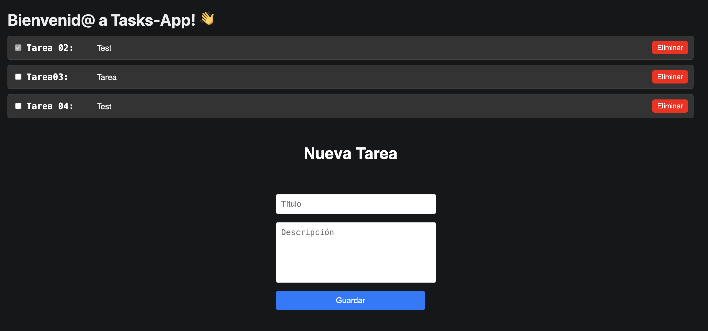

# 3. Crear la funcionalidad CRUD

**Nota:** Hasta el momento, hemos usado las variables `SUPABASE_URL` y `SUPABASE_KEY` en 
`supabaseClient.js` para acceder a los datos necesarios para conectar al backend 
de Supabase. Si bien esto se puede hacer en desarrollo, en general, no es lo mejor 
ya que no queremos exponer claves de API en repositorios o proyectos. 
Ver [gestión de keys](./gestion_keys.md) para resolver esta situación.

---

**Nota:** hasta ahora hemos ejecutado `npm run web` o `npm run start` > <kbd>w</kbd> para probar el build en el navegador. Sin embargo, los componentes de web no se renderizan de forma correcta en móviles. 
Para habilitar el build de móvil hay que modificar los componentes a los equivalentes de React Native, más detalle sobre estos cambios en [Adaptación a Mobile](./adaptacion_mobile.md).

---

## 3.1 Listar tareas (actualizado a mobile)

1. Crea un componente `TaskList` que haga una consulta a Supabase. Colocamos el
componente en `crud/TaskList.tsx`.

**Resumen de los cambios para mobile**

Se reemplazaron componentes web como `<ul>` y `<li>` por `<FlatList>`, optimizando el rendimiento en listas con scroll. Además, se usaron `<View>` y `<Text>` para estructurar las tareas, junto con estilos gestionados mediante `StyleSheet`.

  ```tsx
    import React, { useEffect, useState } from 'react';
    import { View, Text, StyleSheet, FlatList } from 'react-native';
    import supabase from '@app/supabaseClient';

    interface Task {
      id: number;
      title: string;
      description: string;
      completed: boolean;
    }

    const TaskList: React.FC<TaskListProps> = ({ reload }) => {
      const [tasks, setTasks] = useState<Task[]>([]);

      const fetchTasks = async () => {
        const { data, error } = await supabase
          .from('tasks')
          .select('*')
          .order('id', { ascending: false });
        if (!error && data) setTasks(data as Task[]);
      };

      useEffect(() => {
        fetchTasks();
      }, []);

      // Actualización de tareas condicional con flag reload:
      useEffect(() => {
        if (reload) {
          fetchTasks(); // Recarga las tareas cuando cambia `reload`
        }
      }, [reload]);

      return (
        <FlatList
          data={tasks}
          keyExtractor={(item) => item.id.toString()}
          renderItem={({ item }) => (
            <View style={styles.taskItem}>
              <Text style={styles.taskText}>
                {item.title} - {item.completed ? '✅' : '❌'}
              </Text>
            </View>
          )}
          contentContainerStyle={{ paddingBottom: 20 }}
        />
      );
    };

    const styles = StyleSheet.create({
      taskItem: {
        backgroundColor: '#333',
        padding: 15,
        marginVertical: 5,
        borderRadius: 5,
        borderColor: '#444',
        borderWidth: 1,
      },
      taskText: {
        color: 'white',
        fontSize: 16,
      },
    });

    export default TaskList;
  ```

## 3.2 Crear/Editar tareas (actualizado a mobile)

1. Crea un componente `TaskForm` para manejar la creación y edición. Para ellos
creamos un archivo `crud/TaskForm.tsx`.

**Resumen de los cambios para mobile**

Para manejar la creación y edición de tareas en mobile, usamos componentes nativos de React Native como <TextInput>, <TouchableOpacity>, y gestionaremos los eventos utilizando el patrón de props y estado.

    ```tsx
    import React, { useState } from 'react';
    import { View, Text, TextInput, TouchableOpacity, StyleSheet } from 'react-native';
    import supabase from '@app/supabaseClient';

    interface TaskFormProps {
      task?: Task; // Ahora es opcional
      onSave: (task: Task) => void; // Callback para notificar al componente padre cuando se guarde una tarea
      onCancel: () => void;
    }

    const TaskForm: React.FC<TaskFormProps> = ({ task, onSave, onCancel }) => {
      const [title, setTitle] = useState(task?.title || ''); // Valor inicial desde la tarea existente
      const [description, setDescription] = useState(task?.description || ''); // Valor inicial desde la tarea existente

      const handleSubmit = () => {
        // Construye el objeto updatedTask combinando la tarea existente con los valores actuales
        const updatedTask = { ...task, title, description };
        console.log('form:', updatedTask);
        onSave(updatedTask); // Llama a onSave pasando el objeto actualizado
      };

      return (
        <View style={styles.container}>
          {/* Cambia el título dinámicamente según si es creación o edición */}
          <Text style={styles.title}>{task ? 'Editar Tarea' : 'Crear Tarea'}</Text>
          <TextInput
            style={styles.input}
            value={title}
            onChangeText={setTitle} // Actualiza el estado local
            placeholder="Título"
            placeholderTextColor="#ccc"
          />
          <TextInput
            style={[styles.input, styles.textarea]}
            value={description}
            onChangeText={setDescription} // Actualiza el estado local
            placeholder="Descripción"
            placeholderTextColor="#ccc"
            multiline
          />
          <TouchableOpacity style={styles.button} onPress={handleSubmit}>
            <Text style={styles.buttonText}>Guardar</Text>
          </TouchableOpacity>
          {onCancel && (
            <TouchableOpacity style={[styles.button, styles.cancelButton]} onPress={onCancel}>
              <Text style={styles.buttonText}>Cancelar</Text>
            </TouchableOpacity>
          )}
        </View>
      );
    };

    const styles = StyleSheet.create({
      container: {
        flex: 1,
        justifyContent: 'center',
        alignItems: 'center',
        padding: 20,
      },
      title: {
        fontSize: 24,
        fontWeight: 'bold',
        color: 'white',
        marginBottom: 20,
      },
      input: {
        width: '100%',
        padding: 10,
        borderWidth: 1,
        borderColor: '#ccc',
        borderRadius: 5,
        fontSize: 16,
        color: 'white',
        backgroundColor: '#333',
        marginBottom: 10,
      },
      textarea: {
        height: 100,
        textAlignVertical: 'top',
      },
      button: {
        width: '100%',
        padding: 15,
        backgroundColor: '#007bff',
        borderRadius: 5,
        alignItems: 'center',
      },
      buttonText: {
        color: 'white',
        fontSize: 16,
        fontWeight: 'bold',
      },
    });

    export default TaskForm;
    ```

**Nota:** `saveTask` renombrado `saveOrUpdateTask` => función que realizar 
`insert` si no hay id (tarea nueva) o realiza `update` si hay id (tarea existente).

## 3.3 Completar tareas

1. Añade un checkbox y una función para marcar tareas como completadas:

### Función: `markAsCompleted`

Este método permite marcar una tarea como completada actualizando su estado tanto en la base de datos como en el estado local del componente.

### Pasos del funcionamiento

1. **Actualización en la base de datos:**
   - Usa el cliente de Supabase para realizar una operación de actualización (`update`) en la tabla `tasks`.
   - Busca la tarea específica por su `id` y actualiza el campo `completed` a `true`:

     ```typescript
     await supabase.from('tasks').update({ completed: true }).eq('id', id);
     ```

2. **Verificación de errores:**
   - Si ocurre un error durante la actualización, se registra en la consola:

     ```typescript
     if (error) {
       console.error('Error al marcar como completado:', error);
     }
     ```

3. **Actualización del estado local:**
   - Si la operación en la base de datos es exitosa, se utiliza `setTasks` para actualizar el estado local del componente.
   - Se mapea el arreglo de tareas y, para la tarea con el mismo `id`, se actualiza su campo `completed` a `true`:

     ```typescript
     setTasks((prevTasks) =>
       prevTasks.map((task) => (task.id === id ? { ...task, completed: true } : task))
     );
     ```
### Por qué se organiza de esta forma:

- **Sincronización de datos:** Asegura que el estado local esté en línea con los cambios realizados en la base de datos.
- **Evita recargas innecesarias:** No requiere volver a realizar una consulta completa a la base de datos para reflejar el cambio.
- **UX mejorada:** Actualiza la interfaz de usuario inmediatamente después de que el usuario marca una tarea como completada.

### Ejemplo de uso:
Cuando un usuario interactúa con el checkbox o botón para completar una tarea, este método se invoca con el `id` de la tarea correspondiente:

    ```tsx
    <TouchableOpacity onPress={() => markAsCompleted(task.id)}>
      <Text>{task.completed ? 'Completado' : 'Completar'}</Text>
    </TouchableOpacity>
    ``` 

De esta manera, la tarea se actualiza tanto en la base de datos como en la lista visible del usuario.

**Nota:** para marcar como completado o desmarcar es más simple colocar un 
"toggler" (conmutador) que cambia el estado de la tarea entre uno y otro (es un 
boolean así que true o false). Ver `toggleTaskCompletion` en `TaskList` para más 
información.

## 3.4 Eliminar tareas

1. Implementa una función para eliminar tareas con `deleteTask` en `TaskList`.

### Función: `deleteTask`

Este método permite eliminar una tarea de la base de datos y, al mismo tiempo, actualizar el estado local del componente para reflejar el cambio.

### Pasos del funcionamiento:

1. **Eliminación en la base de datos:**
   - Usa el cliente de Supabase para realizar una operación de eliminación (`delete`) en la tabla `tasks`.
   - La tarea a eliminar se busca utilizando su `id`:

     ```typescript
     await supabase.from('tasks').delete().eq('id', taskId);
     ```

2. **Verificación de errores:**
   - Si ocurre un error durante la operación de eliminación, este se registra en la consola:

     ```typescript
     if (error) {
       console.error('Error al borrar la tarea:', error);
     }
     ```

3. **Actualización del estado local:**
   - Si la operación en la base de datos es exitosa, se utiliza `setTasks` para actualizar el estado local del componente.
   - Se filtra el arreglo de tareas y se excluye la tarea que coincide con el `id` eliminado:

     ```typescript
     setTasks((prevTasks) => prevTasks.filter((task) => task.id !== taskId));
     ```

### Por qué se organiza de esta forma:

- **Sincronización de datos:** Asegura que el estado local refleje los cambios realizados en la base de datos.
- **Eficiencia:** Elimina la tarea directamente del estado local sin necesidad de volver a consultar toda la lista de tareas desde la base de datos.
- **UX mejorada:** Elimina visualmente la tarea inmediatamente después de la acción del usuario.

### Ejemplo de uso:

Cuando un usuario interactúa con un botón de eliminación, este método se invoca con el `id` de la tarea que se desea eliminar:

    ```tsx
    <TouchableOpacity onPress={() => deleteTask(task.id)}>
      <Text>Eliminar</Text>
    </TouchableOpacity>
    ```

De esta manera, la tarea desaparece de la lista tanto en la base de datos como en la interfaz de usuario del cliente.

**Nota:** es importante asegurarse que cuando se actualiza un componente solo 
se vuelve a renderizar (crear la representación visual) este componente o, ideal-
mente, la parte actualizada del mismo y **no** toda la página ni componentes sin 
datos nuevos. Así el rendimiento y la experiencia de usuario son mejores.

El resultado:



---

Paso anterior: [Conexión a Supabase](./02.conexion_a_supabase.md)
|
Siguiente paso: [Retos](./04.retos.md)