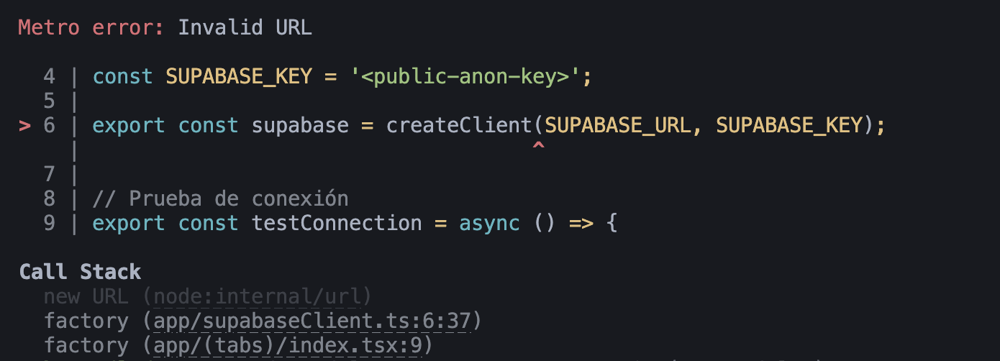
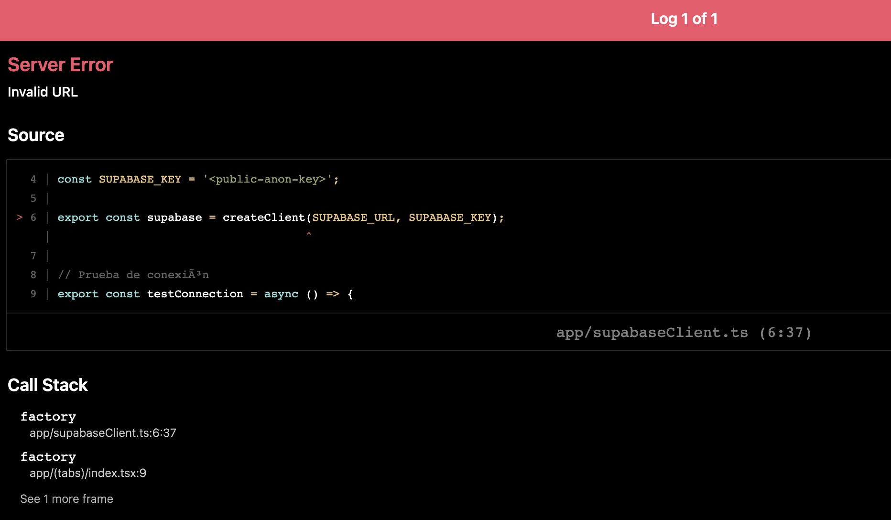
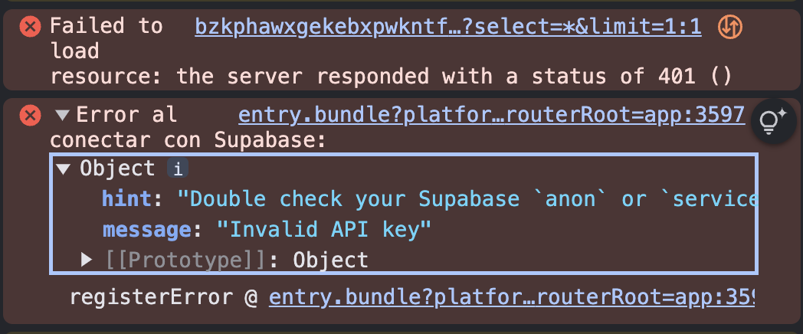
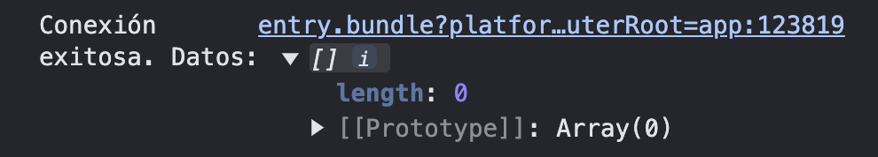
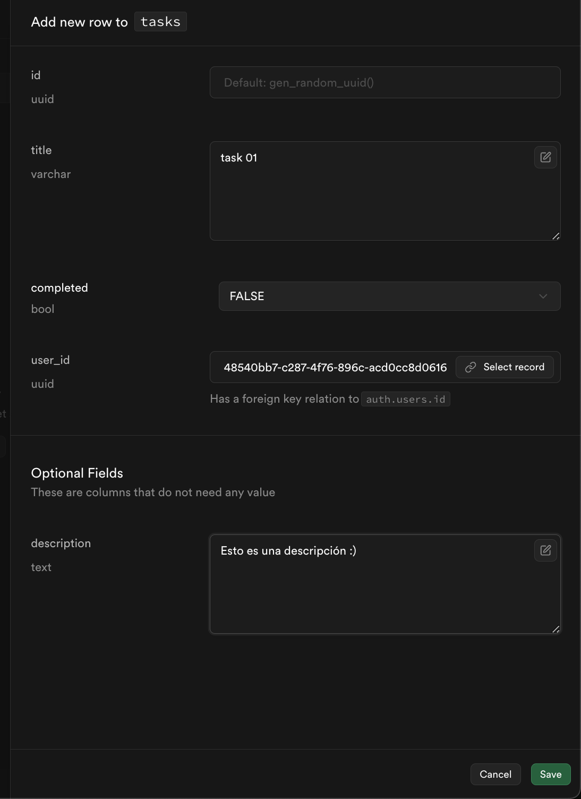
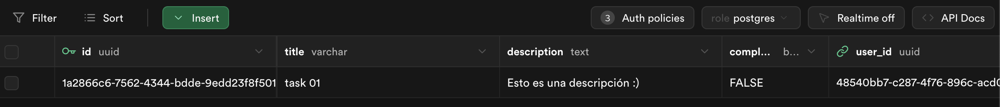
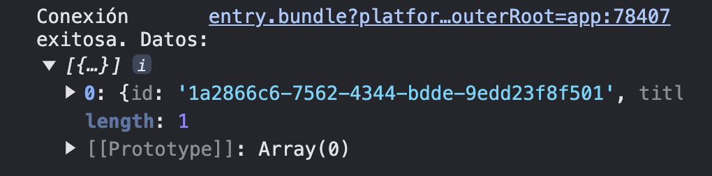

# 2.2 Configurar Supabase en el proyecto

1. Crea un archivo `supabaseClient.ts` en la carpeta `app` del proyecto:

```javascript
import { createClient } from '@supabase/supabase-js';

const SUPABASE_URL = 'https://<your-project-id>.supabase.co';
const SUPABASE_KEY = '<public-anon-key>';

export const supabase = createClient(SUPABASE_URL, SUPABASE_KEY);
```

Añade una prueba de conexión al backend de Supabase solo para verificar que las claves anteriors son correctas:

```javascript
// Prueba de conexión
export const testConnection = async () => {
  try {
    const { data, error } = await supabase.from('tasks').select('*').limit(1);
    if (error) {
      console.error('Error al conectar con Supabase:', error);
    } else {
      console.log('Conexión exitosa. Datos:', data);
    }
  } catch (err) {
    console.error('Error inesperado:', err);
  }
};
```

2. Añadimos una llamada a este método desde el punto de entrada a la app, que puede ser `App.tsx` o `index.tsx` (o `.jsx` si es solo con Javascript), en nuestro caso es el `index.tsx` en `app > (tabs)`:

```javascript
import React, { useEffect } from 'react';
import { testConnection } from '@app/supabaseClient';

export default function App() {
  useEffect(() => {
    testConnection(); // Llama a la prueba de conexión al cargar la app
  }, []);

  /* opcional, solo necesitamos la llamada a `testConnection`: */
  return (
    <div style={{ display: "none" }}> 
      <h6>Supabase Connection Test</h6> 
    </div>
  );
}
```

**Nota:** Sustituye `<your-project-id>` y `<public-anon-key>` con tu URL y clave pública de Supabase creados en el paso anterior.

Si algún dato es incorrecto, en este caso la URL, veremos algo como:

 
y en localhost:



Si el API key es incorrecto veremos en consola de navegador:



Con los datos correctos deberíamos ver:



Y con datos:

**Nota:** para crear un usuario de test podemos usar `supabase.auth.signup` pero debe estar activada la creación de nuevos usuarios y autorizado el dominio necesario. Para crear un usuario manualmente ver [Crear Usuario en Dashboard](./crear_usuario.md).

- Necesitas tener al menos un usuario creado para hacer `tasks` del usuario -> `user_id`





Salida en consola:



**Nota:** si no aparece la tarea, desactiva RLS temporalmente ya que aún no tenemos sesión para identificarnos como el usuario cuya tarea queremos ver, desde SQL Editor:

```sql
ALTER TABLE tasks DISABLE ROW LEVEL SECURITY;
```

**Nota:** cuando modifiques los datos de conexión de supabase hay que parar el proceso y volverlo a iniciar para que las variables se actualicen y se rehaga el bundle.

---

Paso anterior: [Setup](./01.setup.md)
|
Siguiente paso: [CRUD](./03.CRUD.md)