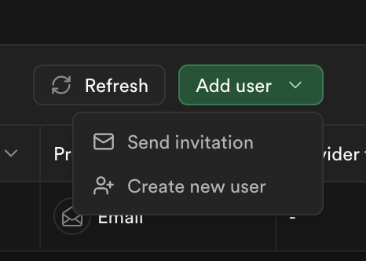
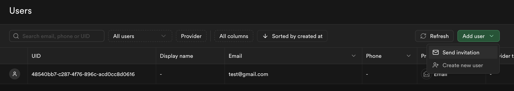

# Crear Usuario desde Dashboard Supabase

## 1. Accede al Dashboard de Supabase

Ve a Supabase Dashboard e inicia sesión.
Selecciona el proyecto en el que deseas crear el usuario.

## 2. Navega a la sección de autenticación

En el menú lateral, haz clic en Authentication > Users.

Aquí verás la lista de usuarios ya registrados en tu proyecto.

## 3. Añadir un nuevo usuario
Haz clic en el botón "Add User" o "Nuevo Usuario" (según el idioma configurado).

Rellena los campos necesarios:

- Email: Dirección de correo del usuario.
- Password: Contraseña para el usuario.
- Email Confirmed (opcional): Marca esta opción si deseas que el usuario esté verificado inmediatamente sin necesidad de confirmar el correo electrónico.
- (Opcional) Añade metadatos personalizados si tu aplicación utiliza información adicional:

También puedes enviar una invitación por email:


Haz clic en Add Metadata e introduce los valores en formato JSON, por ejemplo:

```json
Copy code
{
  "role": "admin",
  "preferences": {
    "theme": "dark"
  }
}
```

## 4. Guarda el usuario

Haz clic en "Save" o "Guardar".



El usuario será creado y aparecerá en la lista de usuarios.

## 5. (Opcional) Verifica la creación del usuario

Ejecuta esta consulta SQL en el editor de consultas de Supabase para confirmar que el usuario fue creado:

```sql
SELECT * FROM auth.users WHERE email = '<correo_del_usuario@example.com>';
-- o para ver todos:
SELECT * FROM auth.users;
```

**Notas importantes**

- **Confirmación de correo:** Si la opción "Email Confirmed" no está seleccionada, el usuario deberá confirmar su cuenta mediante el enlace enviado al correo electrónico.
- **Políticas de RLS (Row-Level Security):** Si estás utilizando una tabla adicional como profiles para gestionar información extra del usuario, asegúrate de que las políticas de RLS permitan al nuevo usuario acceder a su perfil.

**Consejo adicional**

Para proyectos en producción, es preferible que los usuarios se registren a través del frontend de tu aplicación utilizando el método supabase.auth.signUp. Esto asegura que se sigan los flujos de autenticación correctamente.

