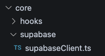
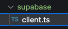
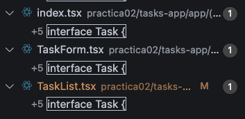
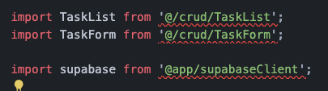
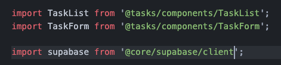
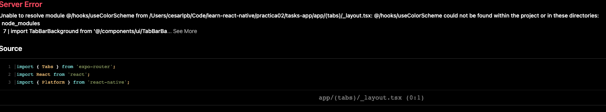
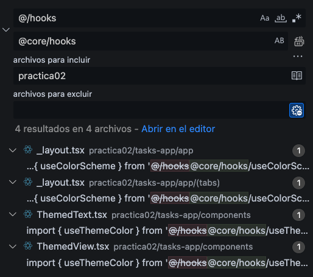
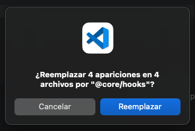
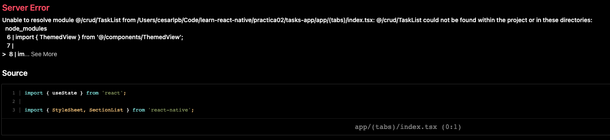
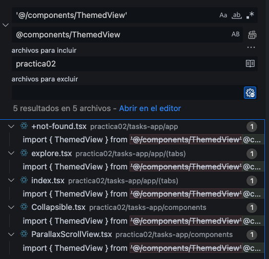

# Uso de Storage en Supabase

Primero, vamos a implementar la funcionalidad para subir archivos sin tener en 
cuenta los permisos del usuario, es decir, serán públicos.

Después, vamos a incluir la funcionalidad de iniciar sesión para que un usuario
solo pueda interactuar con sus propios archivos (funcionamiento habitual en una
app como Google Drive, Dropbox, etc.).

Finalmente, vamos a incluir una funcionalidad simple de compartir archivos para
que un usuario pueda ver un archivo compartido por nosotros.

---

## Pasos Previos

### Reubicación de archivos: Screaming Architecture

Actualmente, no todos los archivos no están ubicados en el proyecto según su 
funcionalidad. Esto es recomendable para proyectos que involucren escalabilidad y
equipos de trabajo colaborando.

Usaremos la metodología denominada "Screaming Architecture" para reubicar los archivos
del proyecto. Esta metodología se puede resumir de la siguiente forma:

> Se colocan los archivos en carpetas según funcionalidad y acción a realizar, 
los archivos se nombran de forma idéntica en estas carpetas.

Es decir, si necesito dos controladores para dos features de "alquiler de coches" 
y "subida de archivos" crearía las carpetas `car-rental` y `uploads` y colocaría
el controlador respectivo en cada subcarpeta. 

Más información sobre screaming architecture en:

- [🇪🇸 Post sobre Screaming Architecture](https://withoutdebugger.com/2023/11/25/screaming-architecture/)
- [🇬🇧 Screaming aplicado a React](https://dev.to/profydev/screaming-architecture-evolution-of-a-react-folder-structure-4g25)
- [🇬🇧 Explicación sobre Screaming](https://www.milanjovanovic.tech/blog/screaming-architecture)

#### Archivos de Practica 01

Primer nivel de carpetas en `tasks-app`:

```bash
  $ tree -L 1 tasks-app
  
  tasks-app
  ├── README.md
  ├── app
  ├── app.json
  ├── assets
  ├── components
  ├── constants
  ├── crud
  ├── env.local.sample
  ├── expo-env.d.ts
  ├── hooks
  └── node_modules
```

Segundo nivel:

```bash
  $ tree -L 2 tasks-app
  tasks-app
  ├── README.md
  ├── app
  │   ├── (tabs)
  │   ├── +not-found.tsx
  │   ├── _layout.tsx
  │   └── supabaseClient.ts
  ├── app.json
  ├── assets
  │   ├── fonts
  │   └── images
  ├── components
  │   ├── Collapsible.tsx
  │   ├── ExternalLink.tsx
  │   ├── HapticTab.tsx
  │   ├── HelloWave.tsx
  │   ├── ParallaxScrollView.tsx
  │   ├── ThemedText.tsx
  │   ├── ThemedView.tsx
  │   ├── __tests__
  │   └── ui
  ├── constants
  │   └── Colors.ts
  ├── crud
  │   ├── TaskForm.tsx
  │   └── TaskList.tsx
  ├── env.local.sample
  ├── expo-env.d.ts
  ├── hooks
  │   ├── useColorScheme.ts
  │   ├── useColorScheme.web.ts
  │   └── useThemeColor.ts
  └── node_modules
      ├── @0no-co
      ├── @ampproject
      ├── @babel
      ├── ...
      ├── chownr
      ├── chrome-launcher
      ├── chrome-trace-event
```

Aplicando Screaming Architecture:

```bash
  tasks-app/
  ├── app/                              <- se mantiene igual
  ├── assets/                           <- se mantiene igual
  ├── components/
  │   ├── ui/                           <- se mantiene igual
  │   ├── Collapsible.tsx               <- se mantiene igual
  │   ├── ExternalLink.tsx              <- se mantiene igual
  │   ├── HapticTab.tsx                 <- se mantiene igual
  │   ├── HelloWave.tsx                 <- se mantiene igual
  │   ├── ParallaxScrollView.tsx        <- se mantiene igual
  │   ├── ThemedText.tsx                <- se mantiene igual
  │   ├── ThemedView.tsx                <- se mantiene igual
  │   └── __tests__/                    <- se mantiene igual
  ├── constants/
  │   └── Colors.ts                     <- se mantiene igual
  ├── core/
  │   ├── supabase/
  │   │   └── supabaseClient.ts         <- lo movemos desde `app/supabaseClient.ts`
  │   ├── hooks/
  │   │   ├── useColorScheme.ts         <- lo movemos desde `hooks/`
  │   │   ├── useColorScheme.web.ts     <- lo movemos desde `hooks/`
  │   │   ├── useThemeColor.ts          <- lo movemos desde `hooks/`
  ├── features/
  │   ├── tasks/
  │   │   ├── components/
  │   │   │   ├── TaskForm.tsx          <- lo movemos desde `crud/TaskForm.tsx`
  │   │   │   ├── TaskList.tsx          <- lo movemos desde `crud/TaskList.tsx`
  │   │   ├── services/
  │   │   │   └── taskService.ts        <- nuevo archivo para la lógica de tareas
  │   │   ├── models/
  │   │   │   └── Task.ts               <- nuevo archivo para definir el modelo `Task`
  │   │   └── screens/
  │   │       └── TaskScreen.tsx        <- combina TaskForm y TaskList => componente completo para los Tasks
  │   │       ...
  ├── env.local.sample                  <- se mantiene igual
  ├── expo-env.d.ts                     <- se mantiene igual
  └── node_modules/                     <- se mantiene igual
```

Mientras se realiza la reubicación, hay que confgurar alias en `tsconfig.json`
para importar los archivos necesarios y se recomienda renombrar algunos archivos
para no ser redundantes, por ejemplo:



En este caso `supabase/supabaseClient.ts` es repetitivo, lo renombramos como
`supabase/client.ts` ya que no tendría sentido un cliente (arhivo con clase 
singleton para conectar al servicio) de otro proveedor en esta carpeta. En algunos 
casos se puede preferir `index.*` como el punto de entrada de la carpeta 
(`index.ts` haría el exporte del client y habría un `client.ts` con la clase) pero es 
más útil cuando se usan muchos archivos. Screaming es muy adaptable en este sentido.



**Nota:** a veces el servidor de Typescript no detecta el renombre del archivo
inmediatamente, si esta línea tiene el alias y la importación bien pero sale error:

```typescript
  import supabase from '@core/supabase/client';
```

`tsconfig.json`:

```typescript
...
  // dentro de "paths":
  "@core/*": [
        "./core/*"
      ]
...
```

Soluciones habituales de problemas con importacines en `.ts` pueden ser:

- Reiniciar el servidor de Typescript: <kbd>Ctrl</kbd> + <kbd>Shift</kbd> + <kbd>C</kbd> -> reiniciar servidor Typescript
- Borrar hasta la última `/` incluida (en `'@core/supabase/client'`) y usar el autocompletado para que se recargue la referencia de la imporación 
- Cerrar y abris VS Code

La importación es correcta si al hacer <Ctrl> + click en `'@core/supabase/client'` 
se abre el archivo.

**Nota:** vamos a evitar referencias relativas como:

```typescript
  import TaskForm from './TaskForm';
```

cambiado a:

```typescript
  import TaskForm from '@tasks/components/TaskForm';
```

Esta importación es más verbosa y tal vez no se vea su utilidad inmediatamente.
Sin embargo, imaginemos que tenemos formularios de alquiler de coches y de tareas
y que, ademas, ambos se llaman `form.jsx`, ¿no sería mejor importarlos así?

```typescript
  import TaskForm from '@tasks/components/form';
  import TaskForm from '@carRental/components/form';
```

O incluso hacer una carpeta forms y definir más el formulario: rentCarForm, rentCar, 
create, createForm, etc. Nótese que en este caso incluir `Form` en el nombre de 
archivo sería opcional. No vamos a especificar tanto por ahora pero se puede apreciar
las opciones para escalar el proyecto con esta arquitectura.

### Limpieza del Código: refactor

Si buscamos el siguiente snippet aparece más de una vez en el código de practica 01:

```typescript
  interface Task {
    id: number;
    title: string;
    description: string;
    completed: boolean;
  }
```

Esta interfaz sirve para declarar un tipo que se debe usar en alguna parte del proyecto.
No tiene sentido que aparezca en más de un lugar el 99% de las veces ya que mantener 
las interfaces al día sería complicado. Vamos a recolocar esta interfaz en `tasks/models`
ya que sirve también para modelizar los datos de una tarea y pasamos a importar desde
`Task.ts`.



Usamos la lupa de VS Code para buscar en todos los archivos dentro de `practica02`:

- Borramos la interfaz
- Actualizamos (si es necesario) el `tsconfig.json` con un alias
- Importamos desde `Task.ts` en: `index.tsx`, `TaskForm.tsx` y `TaskList.jsx`

**Nota:** es posible hacer este refactor desde la lupa usando `Reemplazar`. 
Especialmente útil cuando son muchos archivos para editar.

```typescript
// Define el tipo de las tareas -> importamos desde Task.ts
import Task from '@tasks/models/Task';
```

Resolvemos estos problemas de importación en `index.tsx`:



Según como hayas creados los alias y colocado las importaciones podrías encontrar
otros problemas similares en diversos archivos. El resultado puede ser similar a:



Llegados a este punto podemos probar con `npm run web` si el proyeto refactorizado
funciona como debe:



Es posible que veas errores de importaciones como este. Se debe a como se accede 
a la carpeta `hooks`, se puede resolver creando otro alias o editando la imporación 
desde la lupa:



Si quieres reemplazar todo tendrás que confirmar:



Este otro error de importación también es debido al cambio de carpetas:



Usamos la lupa y creamos el alias `components` (opcional):



**Observación:** en la primera caja no hace falta colocar `'` y `'` ya que borraría 
las comillas.

**Nota:** Es posible hacer <kbd>Ctrl</kbd> + <kbd>Z</kbd> para deshacer una edición 
múltiple con esta herramienta. 

---

Siguiente paso: [Storage](./02.storage.md)