# Feature: Storage

Para agrupar los componentes y archivos del feature de subidas de archivos creamos
la carpeta `features/uploads`.

## Carpetas y Archivos

- Creamos las siguientes carpetas y archivos:

```bash
  features
    ├── components
    │   ├── FileUploades.tsx      <- componentes para la subida de archivos
    ├── models
    │   ├── File.ts               <- modelo para gestionar datos de archivo
    ├── services
    │   ├── 
```

- Añadimos el alias de `uploads` en `tsconfig.json`:

```typescript
      "@uploads/*": [
        "./features/uploads/*"
      ]
```

## FileUploader

Creamos el archivo `FileUploader.tsx` en `uploads/components` con esta funcionalidad:

**En Supabase:**

- [ ] Crear un bucket en Supabase llamado `uploads` antes de usar este componente.

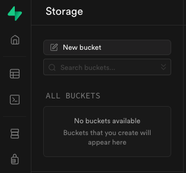

Colocamos el bucket como **público** solo para pruebas (no se debe hacer a menos que 
realmente los archivos deban ser leídos por cualquier usuario sin identificarse)

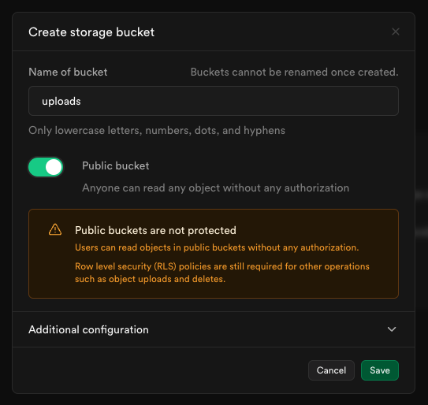

**Funciones principales:**

- `fetchFiles`: Obtiene la lista de archivos desde el bucket de Supabase.
uploadFile: Usa `expo-document-picker` para seleccionar un archivo y subirlo a Supabase.

Instalar el paquete de Expo para gestionar archivos:

```bash
  npm install expo-document-picker
```

**Interfaz:**

- Un botón para subir archivos.
- Una lista que muestra el nombre y la URL pública de cada archivo.

**Integración con Supabase:**

- Usa el método `supabase.storage.from(bucket).upload` para subir archivos.
- Usa `supabase.storage.from(bucket).list` para listar los archivos disponibles.

Ver los detalles en el archivo 
[FileUploader.tsx](../tasks-app/features/uploads/components/FileUploader.tsx).

## Tab: upload

- [ ] Renombramos la pestaña `explore` en `app/(tabs)/` por `upload.tsx`.
- [ ] Borramos el contenido actual para colocar ahi el `<View>` con `FileUploader`.
Contenido inicial:

```tsx
import { StyleSheet, View, Text } from 'react-native';

export default function TabTwoScreen() {
  return (
    <View style={styles.container}>
      <Text style={styles.h2}>File Uploader</Text>
    </View>
  )
}

const styles = StyleSheet.create({
  container: {
    backgroundColor: '#505050',
    flex: 1,
    display: 'flex',
    alignItems: 'center',
    alignContent: 'center',
    height: 100
  },
  h2: {
    color: '#f0f0f0',
    marginTop: 32,
    fontSize: 32,
    fontWeight: 'bold'
  }
});
```

- [ ] Ejecutamos la app de nuevo con `npm run web` y debemos ver la pestaña actualizada:


Esta pestaña ahora abre la URL local `/upload` donde vemos el componente `upload.tsx`.

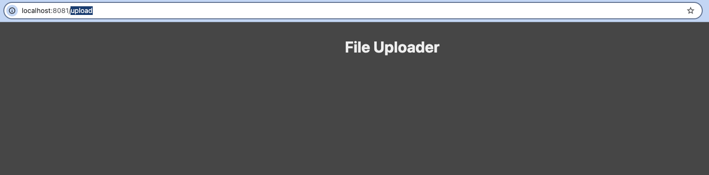

- [ ] Colocamos el `<FileUploader>`:

```tsx
export default function TabTwoScreen() {
  return (
    <View style={styles.container}>
      <Text style={styles.h2}>File Uploader</Text>
      <View style={{ flex: 1 }}>
        <FileUploader />
      </View>
    </View>
  )
}
```

**Nota:** al haber reubicado los archivos en carpetas separadas por feature VS Code
puede resolver mejor las importaciones que sugiere, prueb a no poner la importación de
FileUploader > coloca el cursor encima > presiona <kbd>Win</kbd> + <kbd>.</kbd> (a 
veces es otro atajo, con tecla Espacio, etc.) para abrir la sugerencia de importaciones
y selecciona la correcta:

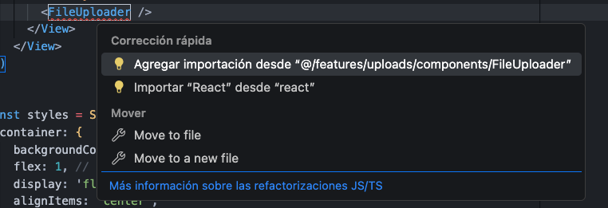

Subida de archivos:

Formulario: 

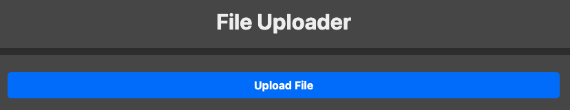

En consola:

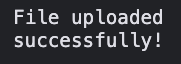

Lista actualizada:

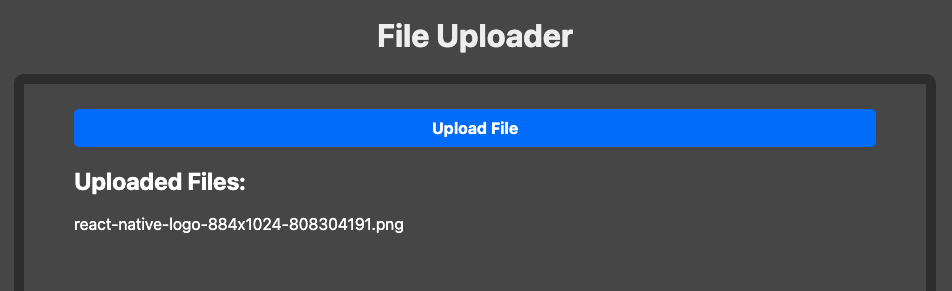

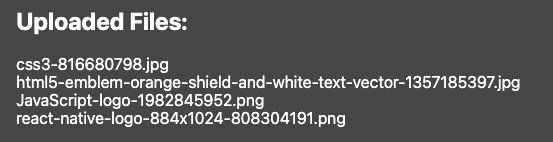

- [ ] Añadimos un `useEffect` que llama a `fetchFiles` para cargar los archivos cuando
se renderiza el componente.

## Problemas comunes

- Si has olvidado configurar el bucket veras algo como esto en consola:

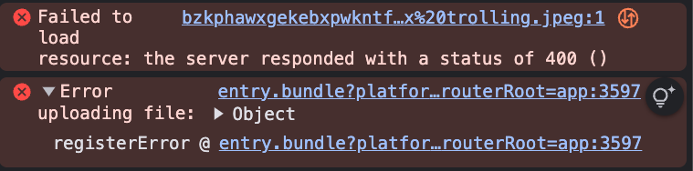

El error 400 indica Bad Request.

- Si ves un warning de una ruta `explore` que no existe como este:

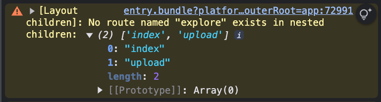

Se debe a que en _layout.tsx la ruta aun sigue enlazada, la renombramos como `upload`:

```tsx
  <Tabs.Screen
    name="upload"
    options={{
      title: 'Upload',
      tabBarIcon: ({ color }) => <IconSymbol size={28} name="paperplane.fill" color={color} />,
    }}
  />
```

- Si recibes un error del POST como este tras subir archivo:

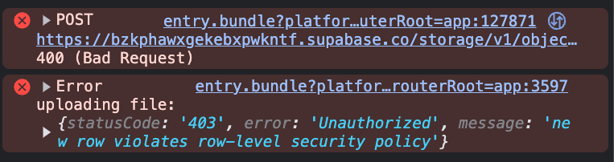

Abre el dashboard de los buckets, selecciona el bucket `uploads`:

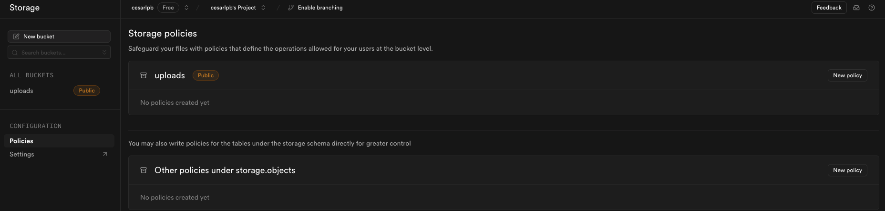

Se debe a que olvidaste permitir con policies que se pueda insertar:

```sql
-- Policy para ejecutar directamente en SQL editor
CREATE POLICY "Allow uploads for all users"
ON storage.objects
FOR INSERT
USING (bucket_id = 'uploads');
```

Click en `new policy` de `uploads` (primera opción) y crear una desde cero 
(sin plantilla, segunda opción):

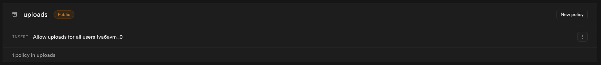

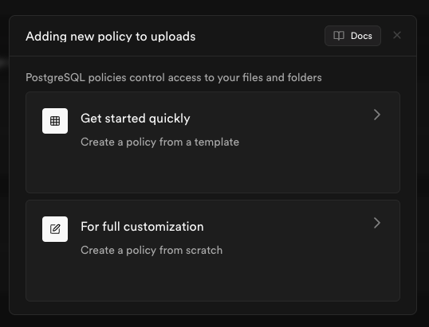

Verás un formulario como este:

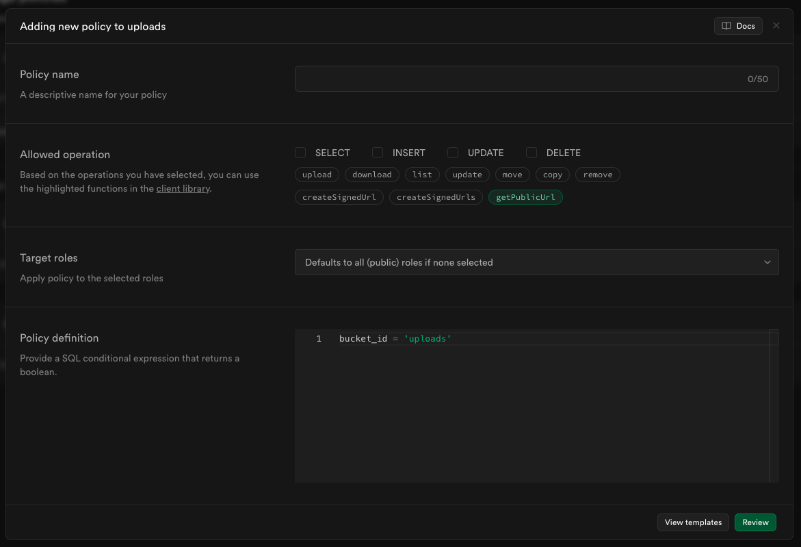

Coloca un nombre para el policy y selecciona qué acción quieres permitir:

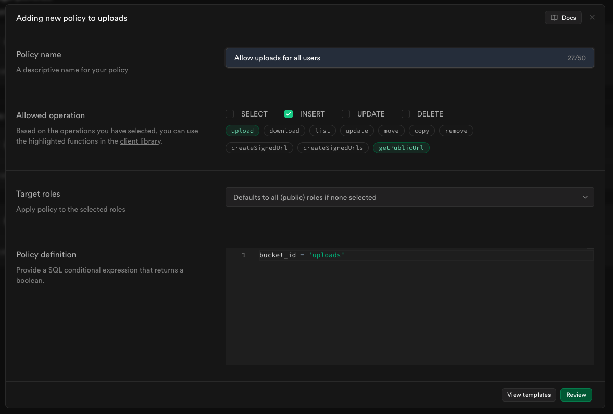

Confirmar:

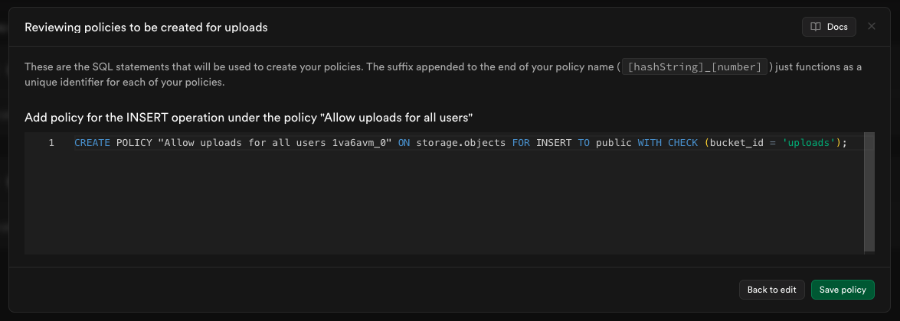

Y para que se puedan leer archivos del bucket de manera pública:

```sql
CREATE POLICY "Allow reads for all users"
ON storage.objects
FOR SELECT
USING (bucket_id = 'uploads');
```

Procedimiento similar al anterior:

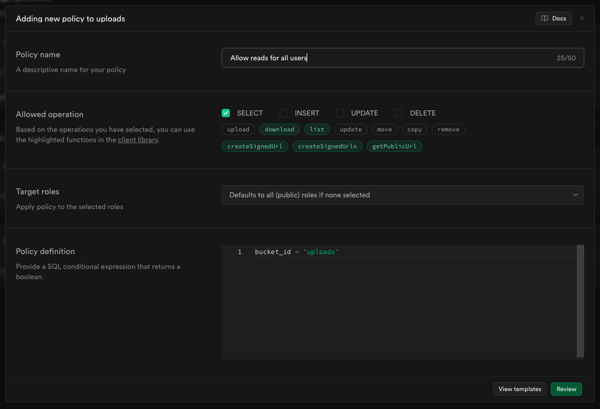

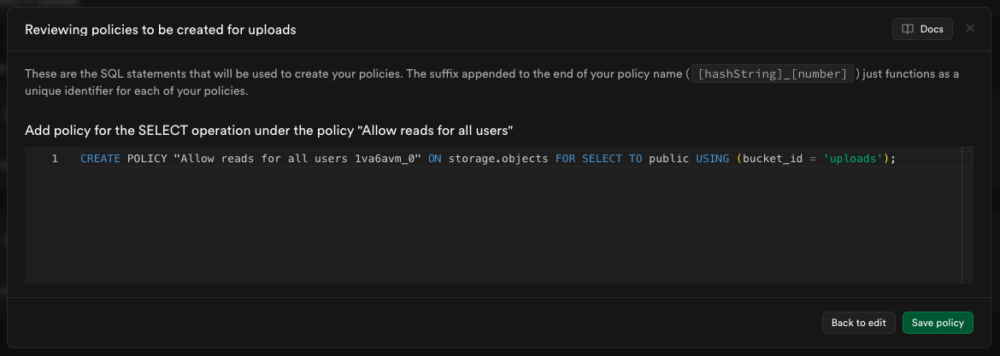

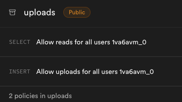

- [ ] Si no te sale el archivo al hacer click en el enlace revisa que la variable 
`EXPO_PUBLIC_BASE_BUCKET_URL` es correcta en el `.env`.

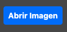

¡Ahora ya puedes subir archivos con el formulario!

---

Paso anterior: [Setup](./01.setup.md)
|
Siguiente paso: [Pruebas de Storage](./03.pruebas.md)