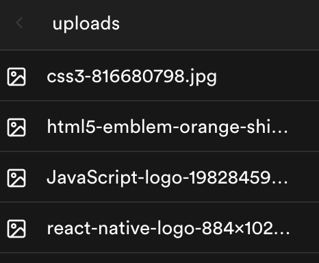
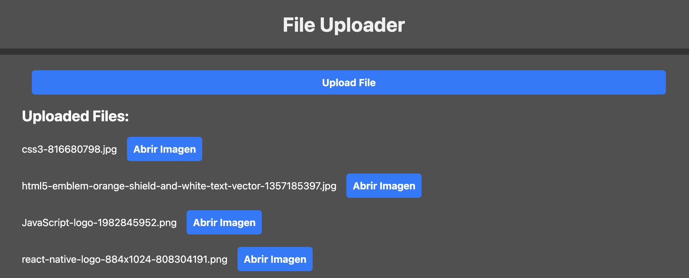

# Pruebas

Para comprobar que el `storage` funciona correctamente podemos hacer un par de pruebas manuales.

- Añadir un archivo desde Supabase > abrimos el proyecto de nuevo en el tab `upload` -> debemos ver el archivo nuevo en la lista

- Añadimos un archivo desde el front end usando `FileUploader` y verificamos desde Supabase que aparece el archivo. Además, en este caso debemos ver el archivo al recargar el componente.

Esta forma de verificar el funcionamiento del componente entra dentro de las funciones de un equipo de `QA` (`quality assurance` o `control de calidad`) donde además de la funcionalidad se comprueba el flujo por parte del usuario y se verifica que cada paso relacionado con la funcionalidad de cargar archivos funciona correctamente.

En la práctica siguiente implementaremos `tests` automáticos para comprobar que estas funcionalidades relacionadas con la subida de archivos operan correctamente tanto en el frontend como en el backend.

---

Paso anterior: [Storage](./02.storage.md)
|
Siguiente paso: [Retos](./04.retos.md)